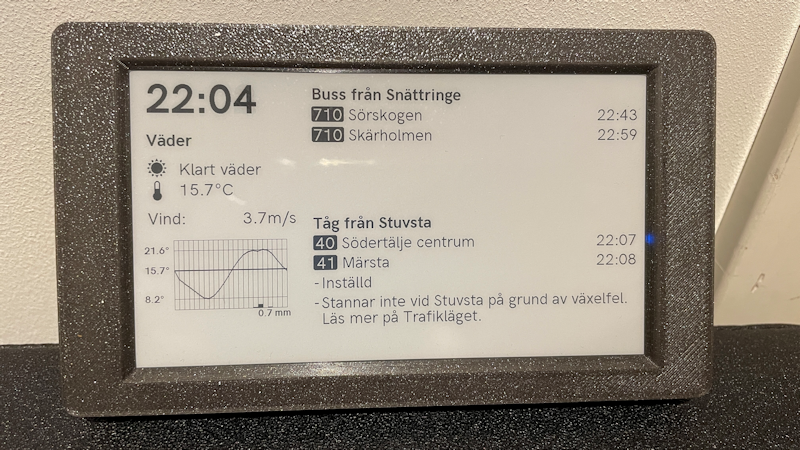

# Inkplate5V2_HomeDashboard

This is a home dashboard for the [Inkplate 5 V2](https://www.inkplate.io/inkplate-5-v2/) e-paper display by Soldered Electronics.
It is based on the [Inkplate-Arduino-library](https://github.com/SolderedElectronics/Inkplate-Arduino-library) and uses the following APIs:
- [SMHI Open Data Meteorological Forecasts, PMP](https://opendata.smhi.se/metfcst/pmp/introduction) for Swedish weather data
- The [Trafiklab SL Transport APIs](https://www.trafiklab.se/api/our-apis/sl/transport/) to get realtime departure times for public transport in Stockholm

## Highlights
- Displays current weather conditions and forecast for the next 24 hours
- Shows realtime departure times for public transport in Stockholm
- Updates the traffic data every 20 seconds and the weather data every 200 seconds
- Uses partial updates to reduce flickering and improve performance.
- A full refresh is done every 10th update to remove ghosting.
- The temperature graph is drawn with graphic primitives

## Overview
The code is a bit of a mess, but it works. The code is a [Plaform IO](https://platformio.org/) project and is structured in the following way:
- `src/` contains the main code for the dashboard
  - `Inkplate5V2_HomeDashboard.ino` is the main entry point for the application
  - `Clock/` - a simple clock display
  - `Fonts/` contains the bitmap fonts used in the dashboard ([Acari Sans](https://github.com/StefanPeev/acari-sans) by Stefan Peev)
  - `PublicTransport/` contains the code to fetch and display public transport data from the Trafiklab SL Transport APIs for public transport in the Stockholm area in Sweden.
  - `Weather/` contains the code to fetch and display weather data from SMHI, the Swedish Meteorological and Hydrological Institute
